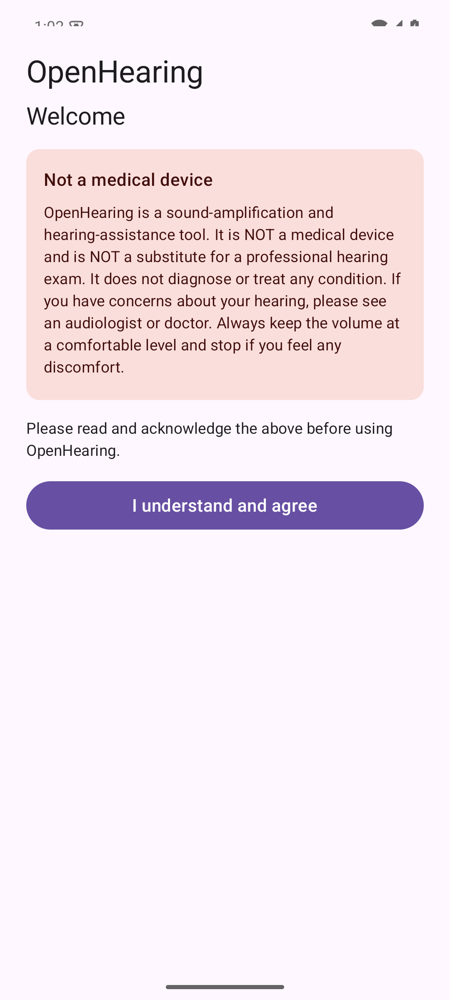
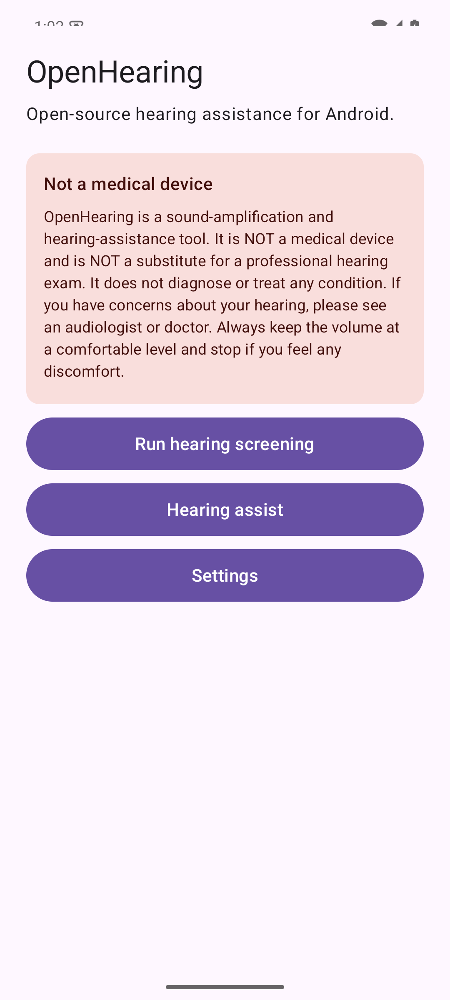
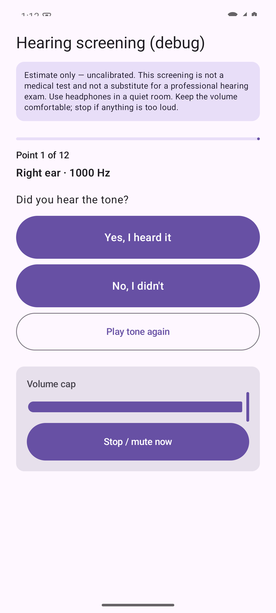
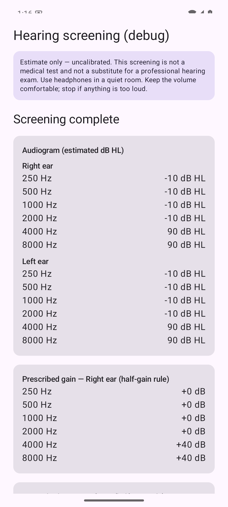
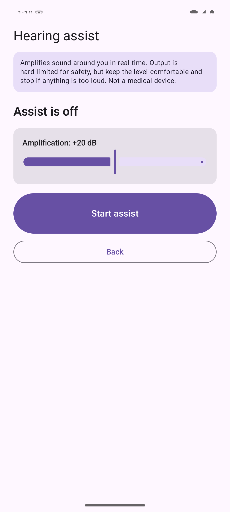
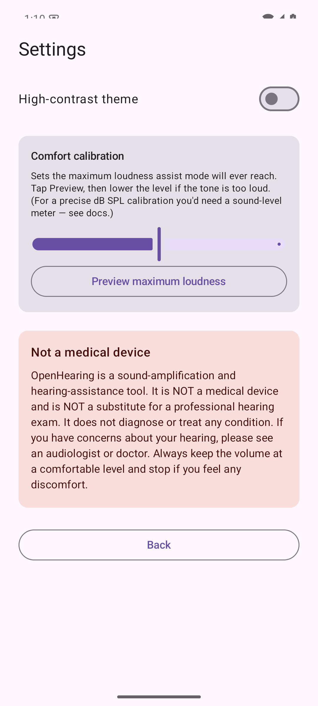

# OpenHearing

**Free, open-source hearing assistance for Android — no root, any earbuds.**

[](https://github.com/HMAKT99/OpenHearing/actions/workflows/ci.yml)
[](LICENSE)

Apple ships a hearing screening and a hearing-aid mode on AirPods Pro 2/3 — but
locks them to iPhone/iPad/Mac. OpenHearing brings open hearing assistance to
**Android**, working with **any** earbuds: screen your hearing, build a
personalized amplification profile, and boost quiet speech in real time.

> Complement to [LibrePods](https://github.com/kavishdevar/librepods): LibrePods
> drives AirPods' own hearing-aid mode (root required); OpenHearing does its own
> on-device processing — **no root, any earbuds.**

---

## ⚠️ Important: this is not a medical device

> **OpenHearing is a sound-amplification and hearing-assistance tool. It is NOT a
> medical device, NOT a certified hearing aid, and NOT a substitute for a
> professional hearing exam.** It does not diagnose or treat any condition. If you
> have concerns about your hearing, see an audiologist or doctor. Keep the volume
> comfortable and stop if anything is too loud.

---

## Screenshots

<table>
  <tr>
    <td></td>
    <td></td>
    <td></td>
  </tr>
  <tr>
    <td align="center"><b>Onboarding</b><br/>acknowledge the disclaimer</td>
    <td align="center"><b>Home</b></td>
    <td align="center"><b>Screening</b><br/>heard / not-heard, with volume cap + stop</td>
  </tr>
  <tr>
    <td></td>
    <td></td>
    <td></td>
  </tr>
  <tr>
    <td align="center"><b>Results</b><br/>audiogram + prescribed gain</td>
    <td align="center"><b>Hearing assist</b></td>
    <td align="center"><b>Settings</b><br/>comfort calibration, high contrast</td>
  </tr>
</table>

> Screenshots are from the running app on an emulator (the screening values shown
> are from an automated test pass). ▶️ A real demo video is coming after on-device
> validation.

---

## Features

- 🎧 **Pure-tone hearing screening** — adaptive (Hughson–Westlake) staircase, per
  ear, per frequency → an audiogram.
- 🔊 **Real-time hearing assist** — multi-band gain from your audiogram, wide
  dynamic-range compression, and a feedback/howl guard.
- 🛡️ **Safety first** — a hard look-ahead output limiter (extensively tested),
  comfort calibration to cap loudness, and an always-available instant **Stop**.
- ♿ **Accessibility-first** — large controls, high-contrast theme, scalable text.
- 🔒 **Private by design** — no accounts, no analytics, no ads, no network access.
  Audio is processed on-device and never recorded or transmitted.
- 🎧 **Any earbuds** — wired or Bluetooth; AirPods support is a future enhancement.

---

## How to use

1. **Install** — sideload the APK from [Releases](https://github.com/HMAKT99/OpenHearing/releases)
   (F-Droid coming). 
2. **Read & accept** the safety disclaimer on first launch.
3. **Run the hearing screening** — put on a headset in a quiet room, tap
   **Run hearing screening → Start**. After each tone, tap **Yes, I heard it** or
   **No, I didn't**. The volume cap and **Stop / mute** are always on screen.
4. **Review your results** — a per-ear audiogram and the prescribed amplification
   (half-gain rule). This is saved as your profile.
5. **Turn on Hearing assist** — grant microphone access, set the amplification
   level, tap **Start assist**. Sound around you is amplified in real time; tap
   **Stop assist** any time.
6. **Calibrate comfort** (Settings) — preview the maximum loudness and lower it
   until comfortable; that caps how loud assist mode can ever get. Toggle the
   high-contrast theme here too.

See [docs/SAFETY.md](docs/SAFETY.md), [docs/CALIBRATION.md](docs/CALIBRATION.md),
and [docs/DEVICE_TESTING.md](docs/DEVICE_TESTING.md) for details.

---

## Build from source

**Requirements:** JDK 17, Android SDK (API 35, build-tools 35.0.0). Point the build
at your SDK via `local.properties` (`sdk.dir=...`) or `ANDROID_HOME`.

```bash
./gradlew ktlintCheck detekt test testDebugUnitTest   # lint + unit tests
./gradlew assembleDebug                                # debug APK
```

CI runs the same checks on every push/PR. Release/signing steps are in
[docs/RELEASE.md](docs/RELEASE.md).

---

## Project status — what's verified vs. not

Early **alpha**: the full software pipeline (screen → profile → real-time assist)
is built and unit-tested, but **not yet validated on real hardware.**

| Area | Status |
|---|---|
| Audiogram screening engine (staircase, fitting) | ✅ pure-Kotlin, unit-tested |
| Real-time assist DSP (EQ + WDRC + feedback guard + limiter) | ✅ unit-tested; limiter safety suite is the release gate |
| Android audio engine + foreground assist service | ✅ builds — **needs on-device validation** |
| Onboarding, persistence, assist UI, accessibility | ✅ |
| Comfort calibration + output ceiling | ✅ (true dB SPL calibration needs a meter) |
| Signed release build, privacy, F-Droid metadata | ✅ — [docs/RELEASE.md](docs/RELEASE.md) |
| AirPods Pro 2/3 detection / transparency routing | ❓ **UNVERIFIED** — [docs/PROTOCOL.md](docs/PROTOCOL.md) |

**On AirPods:** the protocol is reverse-engineered, not public; we build on
[LibrePods](https://github.com/kavishdevar/librepods)/CAPod. It may not be fully
controllable from Android without root/firmware access — which is why OpenHearing
works fully on **any** earbuds first.

---

## Architecture

Clean multi-module Kotlin (Compose/Material 3, MVVM, Hilt, coroutines). DSP and
safety logic live in pure-Kotlin modules so they're unit-tested with no emulator.
See [ARCHITECTURE.md](ARCHITECTURE.md).

`:app` · `:core-common` (units + safety constants) · `:core-audiogram` (screening
+ fitting) · `:core-audio` (DSP + limiter) · `:airpods-protocol` (UNVERIFIED) ·
`:data` (persistence).

---

## Contributing

Contributions welcome — especially **hardware testers** (AirPods Pro 2/3 + an
Android phone) and accessibility feedback. See [CONTRIBUTING.md](CONTRIBUTING.md),
[CODE_OF_CONDUCT.md](CODE_OF_CONDUCT.md), and [docs/SAFETY.md](docs/SAFETY.md).

## License

**GPLv3** — see [LICENSE](LICENSE).

## Credits

- [LibrePods](https://github.com/kavishdevar/librepods) and CAPod for the AirPods
  reverse-engineering groundwork.

> OpenHearing is an independent project, not affiliated with or endorsed by Apple.
> "AirPods" is a trademark of Apple Inc., used only to describe hardware compatibility.
